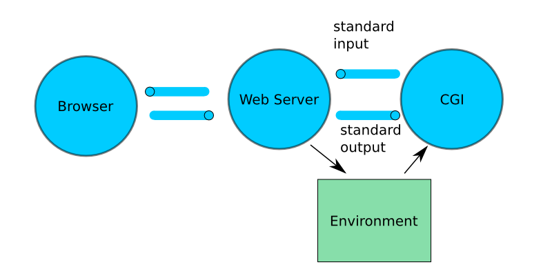

# C++98 HTTP Web Server (Educational Project)

> Minimal yet capable HTTP/1.1 web server implemented from scratch in portable C++98. Reinvents the core serving loop (no external HTTP libs) for learning purposes: parsing, routing, CGI, uploads, auth sessions, static files, and epoll based multiplexing.

## 🚀 Features Overview

- Multi-virtual-host configuration (host:port + per-location rules)
- Non‑blocking I/O + edge oriented event loop (Linux `epoll`) 
- HTTP/1.1 request parsing (start line, headers, chunked + fixed length bodies)
- Supported methods: GET, POST, DELETE
- Static file & directory index resolution (with optional auto-index)
- Per‑location method allowance & custom error pages
- Redirections (301/302/303/304) via config
- File uploads (multipart/form-data & simple bodies) + server side size limits
- Basic session based authentication (login / signup / logout / protected areas)
- Cookie handling & session expiration
- Lightweight CGI execution (Python / Bash examples included)
- Graceful handling of timeouts & body size limits
- Simple utilities for path resolution, MIME / content typing

## 🧭 High Level Architecture

<p align="center">
    
</p>

### Event Driven Flow
<p align="center">
    
</p>

### CGI Integration
<p align="center">
    
</p>

### Core Flow
1. `epoll_wait()` yields ready fds (listen sockets, client sockets, CGI pipes)
2. New clients are accepted and made non‑blocking, inserted into a connection map
3. Reads accumulate into a per‑client buffer until a full header block (`\r\n\r\n`) appears
4. Headers are normalized, framing decided: `Content-Length` vs `Transfer-Encoding: chunked`
5. Chunked bodies are de-chunked incrementally (size line → data → CRLF → repeat)
6. Once the body is complete (or not required), routing selects a location block
7. Method + auth + redirection + size constraints validated
8. Generator builds response: static file, CGI execution, upload handling, or error
9. Socket toggled EPOLLOUT to flush response; connection kept alive when allowed

## 🧱 Request Parsing Highlights
- Stateless tokenizer avoided; uses incremental boundary searching in the accumulated socket buffer
- Header keys canonicalized to lowercase for O(1) map lookups
- Chunked decoder is a small state machine: SIZE → DATA → (repeat) → END
- Body hard limit enforced both pre-read (via `Content-Length`) and during streaming (chunk accumulator)

## 🔐 Sessions & Auth (Conceptual)
- On successful login/signup, server creates a session (opaque id) and sets a cookie
- Subsequent requests look up the session; absence or expiration → redirect to login route
- Protected locations flagged in config; middleware-style gate before handler logic

## 🗂 Configuration Model (Conceptual)
Pseudo‑DSL (inspired by nginx) with hierarchical structure:

```
server {
    host 127.0.0.1:8080;
    root /var/www/site;
    client_max_body_size 25M;  # applied pre-body & during streaming

    error_page 404 /error/404.html;

    location /upload {
        methods GET POST DELETE;
        upload_store /var/www/site/upload/files;
    }

    location /auth { auth on; }

    location /docs { redirect 302 /new-docs; }
}
```

(Current parser expects its own format; this block is illustrative, not exact.)

## ⚙️ Supported CGI
- Spawns interpreter (e.g., `python` / `bash`) with environment variables (method, path, query, etc.)
- Reads stdout through a pipe registered in `epoll`
- Merges script output (headers/body) into HTTP response
- Timeout sweeper reaps long‑running scripts

## 📦 Build & Run (Binary Only)
For now the repository intentionally withholds full source while the writeup is being finalized. A future commit may expose the implementation once documentation & refactoring stabilize.

To build locally (when sources are available):
```
make
./webserv <config-file>
```

## 🖼 Visuals
Current diagrams (all in `docs/`):
- `architecture.png` – high level components & epoll orchestration
- `client-server-flow.png` – request lifecycle & state transitions
- `cgi.png` – CGI subprocess & pipe handling within epoll

Planned additions:
- `chunked-decoder.png`
- `upload-flow.png`
- `auth-session.png`
- `event-loop.png` (sequence variant)
- `request-lifecycle.png` (narrative form)

## 🧪 Example Interactions (Conceptual)
```
GET /            -> 200 index.html
GET /auth        -> 302 /login (no session)
POST /login      -> 302 /auth  (sets Set-Cookie: sessionId=....)
POST /upload     -> 201 + JSON summary of stored file(s)
DELETE /upload/X -> 204 (file removed)
```

## ❗ Design Tradeoffs
- Single process, single thread: simplicity over parallel CPU usage
- epoll based readiness avoids per-thread blocking & scales better than naive select
- Minimal dynamic allocations inside hot paths (reused buffers where safe)
- Custom parser instead of regex for performance & control in C++98 constraints
- No TLS layer (out of scope for educational phase)

## 🧹 Error Handling & Limits
- Central exception types drive HTTP error generation
- Custom error pages if configured; fallback to small inline templates
- Body size + timeout guards prevent resource exhaustion

## 🧭 Roadmap
- [ ] Public release of full parsing & event loop source
- [ ] Config hot-reload (SIGHUP)
- [ ] Directory auto-index generation (HTML table)
- [ ] Basic rate limiting (token bucket per IP)
- [ ] Optional thread pool for CGI / heavy file I/O
- [ ] HTTP persistent connection improvements (pipelining detection)
- [ ] Basic WebSocket upgrade experiment

## 📝 Educational Notes
This project was built under constraints similar to certain systems programming curricula: C++98 standard, no external high-level HTTP frameworks, emphasis on understanding of:
- Socket lifecycle (create → bind → listen → accept → read/write → close)
- Non-blocking I/O patterns
- HTTP/1.1 message framing
- Robust input validation & state tracking
- Resource cleanup and error propagation

## 📄 License
Temporarily All Rights Reserved while code is being polished. Documentation may later switch to a permissive license alongside a source release.

## 🙋 FAQ
Q: Why is the source hidden?  
A: I'm staging a clean public release with full commentary; current code contains experimental sections being refactored.

Q: Can I try a binary?  
A: Planned: pre-built reproducible release once CI is configured.

---
Questions / suggestions? Open an issue — feedback helps shape the upcoming full release.
