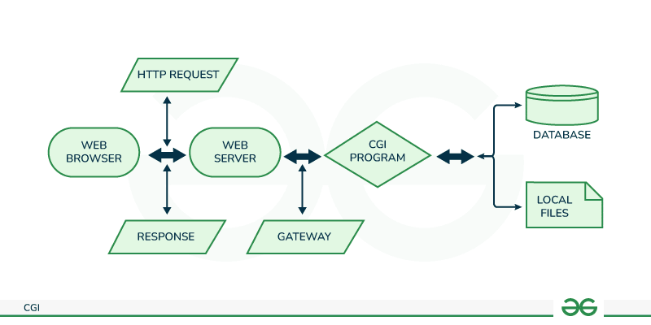
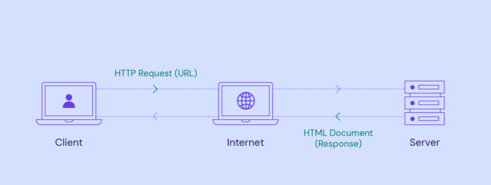

# C++98 HTTP Web Server (Educational Project)

> Minimal yet capable HTTP/1.1 web server implemented from scratch in portable C++98. Reinvents the core serving loop (no external HTTP libs) for learning purposes: parsing, routing, CGI, uploads, auth sessions, static files, and epoll based multiplexing.

## Features Overview

- Multi-virtual-host configuration (host:port + per-location rules)
- Non‑blocking I/O + edge oriented event loop (Linux `epoll`) 
- HTTP/1.1 request parsing (start line, headers, chunked + fixed length bodies)
- Supported methods: GET, POST, DELETE
- Static file & directory index resolution (with optional auto-index)
- Per‑location method allowance & custom error pages
- Redirections (301/302/303/304) via config
- File uploads (multipart/form-data & simple bodies) + server side size limits
- Basic session based authentication (login / signup / logout / protected areas)
- Cookie handling & session expiration
- Lightweight CGI execution (Python / Bash examples included)
- Graceful handling of timeouts & body size limits
- Simple utilities for path resolution, MIME / content typing

## High Level Architecture

<p align="center">
    
</p>

### Event Driven Flow
<p align="center">
    
</p>

### Core Flow
1. `epoll_wait()` yields ready fds (listen sockets, client sockets, CGI pipes)
2. New clients are accepted and made non‑blocking, inserted into a connection map
3. Reads accumulate into a per‑client buffer until a full header block (`\r\n\r\n`) appears
4. Headers are normalized, framing decided: `Content-Length` vs `Transfer-Encoding: chunked`
5. Chunked bodies are de-chunked incrementally (size line → data → CRLF → repeat)
6. Once the body is complete (or not required), routing selects a location block
7. Method + auth + redirection + size constraints validated
8. Generator builds response: static file, CGI execution, upload handling, or error
9. Socket toggled EPOLLOUT to flush response; connection kept alive when allowed

## Request Parsing Highlights
- Stateless tokenizer avoided; uses incremental boundary searching in the accumulated socket buffer
- Header keys canonicalized to lowercase for O(1) map lookups
- Chunked decoder is a small state machine: SIZE → DATA → (repeat) → END
- Body hard limit enforced both pre-read (via `Content-Length`) and during streaming (chunk accumulator)

## Sessions & Auth (Conceptual)
- On successful login/signup, server creates a session (opaque id) and sets a cookie
- Subsequent requests look up the session; absence or expiration → redirect to login route
- Protected locations flagged in config; middleware-style gate before handler logic

## Configuration Model (Conceptual)
Pseudo‑DSL (inspired by nginx) with hierarchical structure:

```
server {
    host 127.0.0.1:8080;
    root /var/www/site;
    client_max_body_size 25M;  # applied pre-body & during streaming

    error_page 404 /error/404.html;

    location /upload {
        methods GET POST DELETE;
        upload_store /var/www/site/upload/files;
    }

    location /auth { auth on; }

    location /docs { redirect 302 /new-docs; }
}
```

(Current parser expects its own format; this block is illustrative, not exact.)

## Supported CGI
- Spawns interpreter (e.g., `python` / `bash`) with environment variables (method, path, query, etc.)
- Reads stdout through a pipe registered in `epoll`
- Merges script output (headers/body) into HTTP response
- Timeout sweeper reaps long‑running scripts

## Build & Run
Requires a POSIX environment (Linux recommended), a C++98 capable compiler (g++ / clang++), and epoll.

```
make            # builds the webserv binary
./webserv config/conf.conf             # single server example
./webserv config/multiserver.conf      # multi‑server (two listen sockets)
```

Flags are defined in the `Makefile`; adjust if you want extra warnings (e.g. `-Wall -Wextra -Werror`).

You can also pass a path to a custom config: `./webserv /path/to/your.conf`.

Exit the server with Ctrl+C.

### Runtime Notes
- Non‑blocking sockets + epoll loop.
- Custom request parser (no external HTTP libs).
- CGI scripts executed based on extension mapping (see `location /cgi` in config). 

If build fails: ensure you are not using a C++ standard later than 98 unless you adapt code (remove `-std=c++98` if experimenting, but project was written to conform to it).

## Required Directory Layout (IMPORTANT for provided configs)
The supplied config files (`config/conf.conf` and `config/multiserver.conf`) use ABSOLUTE paths that match the original development machine (e.g. `/home/sgouzi/www` or `/home/sgouzi/webserv/www`). You MUST either:
1. Create the same directory tree on your machine (not recommended), OR
2. Edit the config file(s) to point to a directory you control (recommended), keeping the subfolder structure.

### Minimal folder set expected by `conf.conf`
Relative form (recommended) if you change `root` to `./www`:
```
./www
    index.html
    error/
        error.html 401.html 404.html (etc.)
    login/ (login.html signup.html)
    auth/  (dashboard.html ...)
    upload/
        files/   # destination for uploaded files
    post/
        files/   # if using multiserver variant upload_dir points here
    redirect/ (optional pages referenced in redirects)
    cgi/      (python / bash scripts if using CGI)
```

### What each config directive expects
- `root` (server block): base directory for static lookups when a `location` does not override `root`.
- `errorFolder`: directory containing error templates (e.g. `error.html`, `404.html`).
- `loginLocation`, `signupLocation`, `logoutLocation`, `authLocation`, `uploadLocation`: logical URL prefixes; corresponding `location` blocks map them to physical directories.
- `upload_dir` (inside a location): physical destination directory for uploaded files; MUST exist and be writable by the server process.
- `cgi_path <ext> <interpreter>`: interpreter binary must exist and be executable.

### Quick setup helper (adjust ROOT as you like)
```
ROOT=./www
mkdir -p "$ROOT"/error "$ROOT"/login "$ROOT"/auth \
                 "$ROOT"/upload/files"" "$ROOT"/post/files "$ROOT"/redirect "$ROOT"/cgi
touch "$ROOT"/index.html
echo '<h1>It works</h1>' > "$ROOT"/index.html
```
(Populate other HTML / CGI scripts as needed; sample scripts can live in `www/cgi/`.)

### Adapting the provided configs
Open `config/conf.conf` and replace every absolute path `/home/sgouzi/www` with your chosen `ROOT` (e.g. `./www`). Do the same for `multiserver.conf` (paths using `/home/sgouzi/webserv/www`). Ensure consistency for:
- `root`
- `errorFolder`
- every `location` block's `root`
- any `upload_dir`

If you forget to change one path, you will likely see 404 responses or failed file opens in stderr.

### Permissions
Make sure the process user has read permission for static files and read/write for upload directories. Example:
```
chmod -R 755 ./www
chmod -R 750 ./www/upload/files ./www/post/files
```

### Multi-server Config
`multiserver.conf` starts two servers (e.g. ports 8080 & 8081). You must ensure both ports are free and both directory trees exist (or updated to your relative structure).

### CGI Scripts
Place scripts in the directory mapped by the `location /cgi` (or equivalent). Ensure they are executable:
```
chmod +x ./www/cgi/*.py ./www/cgi/*.bash 2>/dev/null || true
```
Python / bash / php interpreters must exist at the paths listed in `cgi_path` directives (adjust if needed).

### Common Startup Issues
| Symptom | Likely Cause | Fix |
|---------|--------------|-----|
| 404 for every request | Wrong root path | Update config paths or create folders |
| 500 after upload | Upload dir missing or not writable | Create dir & fix permissions |
| CGI returns 500 | Interpreter path wrong | Adjust `cgi_path` to actual interpreter |
| Immediate exit | Config parse error | Validate braces / directives |

Feel free to create a new simplified config once comfortable.

## 🖼 Visuals
Current diagrams (all in `docs/`):
- `architecture.png` – high level components & epoll orchestration
- `client-server-flow.png` – request lifecycle & state transitions
- `cgi.png` – CGI subprocess & pipe handling within epoll

Planned additions:
- `chunked-decoder.png`
- `upload-flow.png`
- `auth-session.png`
- `event-loop.png` (sequence variant)
- `request-lifecycle.png` (narrative form)

## Example Interactions (Conceptual)
```
GET /            -> 200 index.html
GET /auth        -> 302 /login (no session)
POST /login      -> 302 /auth  (sets Set-Cookie: sessionId=....)
POST /upload     -> 201 + JSON summary of stored file(s)
DELETE /upload/X -> 204 (file removed)
```

## Design Tradeoffs
- Single process, single thread: simplicity over parallel CPU usage
- epoll based readiness avoids per-thread blocking & scales better than naive select
- Minimal dynamic allocations inside hot paths (reused buffers where safe)
- Custom parser instead of regex for performance & control in C++98 constraints
- No TLS layer (out of scope for educational phase)

## Error Handling & Limits
- Central exception types drive HTTP error generation
- Custom error pages if configured; fallback to small inline templates
- Body size + timeout guards prevent resource exhaustion

## Roadmap
- [ ] Public release of full parsing & event loop source
- [ ] Config hot-reload (SIGHUP)
- [ ] Directory auto-index generation (HTML table)
- [ ] Basic rate limiting (token bucket per IP)
- [ ] Optional thread pool for CGI / heavy file I/O
- [ ] HTTP persistent connection improvements (pipelining detection)
- [ ] Basic WebSocket upgrade experiment

## Educational Notes
This project was built under constraints similar to certain systems programming curricula: C++98 standard, no external high-level HTTP frameworks, emphasis on understanding of:
- Socket lifecycle (create → bind → listen → accept → read/write → close)
- Non-blocking I/O patterns
- HTTP/1.1 message framing
- Robust input validation & state tracking
- Resource cleanup and error propagation

## Contributors
This project was developed in collaboration with my teammate **[Asma Koraichi](https://github.com/asmawithoute)**. Her contributions were essential to the successful implementation of this HTTP web server.

## License
Temporarily All Rights Reserved while code is being polished. Documentation may later switch to a permissive license alongside a source release.

## FAQ
Q: Why are there absolute paths in the sample configs?  
A: They reflect the original development environment. Replace them with relative paths (`./www`) or absolute ones valid on your system.

Q: Can I run multiple servers simultaneously?  
A: Yes—`multiserver.conf` demonstrates two `server` blocks (ensure ports are free).

Q: Why epoll and not select/poll?  
A: Better scalability and cleaner edge handling for higher connection counts.

Q: Where do uploaded files go?  
A: Into the directory specified by `upload_dir` inside the relevant `location` (must exist beforehand).

---
Questions / suggestions? Open an issue — feedback helps improve the project.